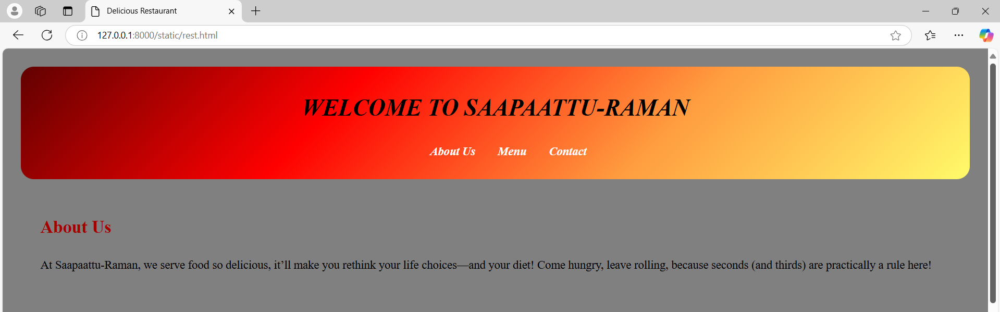
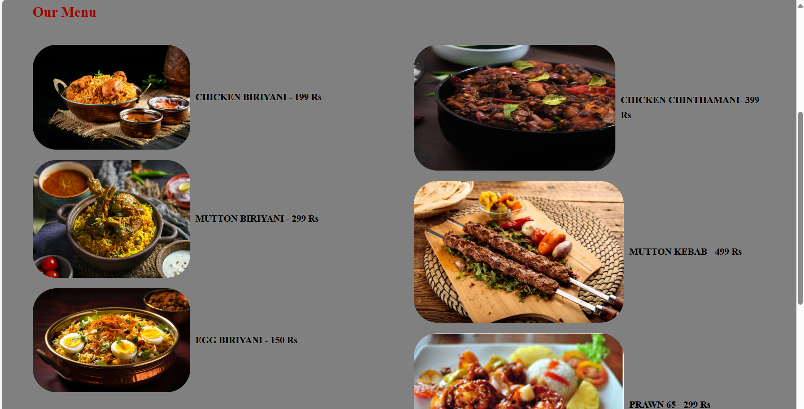
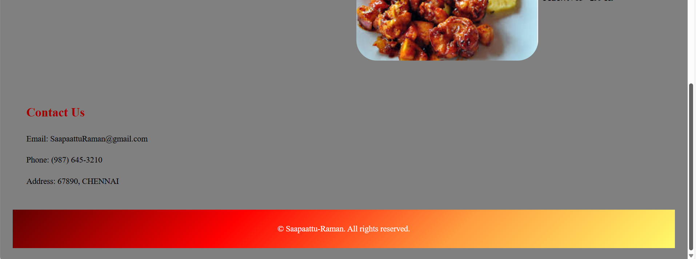

# Ex.07 Restaurant Website
## Date: 18 / 12 / 2024 

## AIM:
To develop a static Restaurant website to display the food items and services provided by them.

## DESIGN STEPS:

### Step 1:
Requirement collection.

### Step 2:
Creating the layout using HTML and CSS.

### Step 3:
Updating the sample content.

### Step 4:
Choose the appropriate style and color scheme.

### Step 5:
Validate the layout in various browsers.

### Step 6:
Validate the HTML code.

### Step 7:
Publish the website in the given URL.

## PROGRAM:

REST.html

```

<html>
<head>
    <meta charset="UTF-8">
    <meta name="viewport" content="width=device-width, initial-scale=1.0">
    <title>Delicious Restaurant</title>
    <link rel="stylesheet" href="rest.css">
</head>
<body bgcolor="grey">
    <header>
        <h1>WELCOME TO SAAPAATTU-RAMAN</h1>
        <nav>
            <ul>
                <li><a href="#about">About Us</a></li>
                <li><a href="#menu">Menu</a></li>
                <li><a href="#contact">Contact</a></li>
            </ul>
        </nav>
    </header>

    <section id="about">
        <h2>About Us</h2>
        <p>At Saapaattu-Raman, we serve food so delicious, it’ll make you rethink your life choices—and your diet! Come hungry, leave rolling, because seconds (and thirds) are practically a rule here!</p>
    </section>

    <section id="menu">
        <h2>Our Menu</h2>
        <div class="menu-container">
            <div class="menu-left">
                <ul>
                    <li>
                        
                        <b>CHICKEN BIRIYANI - 199 Rs</b>
                    </li>
                    <li>
                        
                        <b>MUTTON BIRIYANI - 299 Rs</b>
                    </li>
                    <li>
                        
                        <b>EGG BIRIYANI - 150 Rs</b>
                        </li> 
                    </li>
                </ul>
            </div>
            <div class="menu-right">
                <ul>
                    <li>
                        
                        <b>CHICKEN CHINTHAMANI- 399 Rs</b>
                    </li>
                    <li>
                        
                       <b>MUTTON KEBAB - 499 Rs</b>
                    </li>
                    <li>
                        
                         <b>PRAWN 65 - 299 Rs</b>
                    </li>
                </ul>
            </div>
        </div>
    </section>

    <section id="contact">
        <h2>Contact Us</h2>
        <p>Email: SaapaattuRaman@gmail.com</p>
        <p>Phone: (987) 645-3210</p>
        <p>Address: 67890, CHENNAI </p>
    </section>

    <footer>
        <p>&copy; Saapaattu-Raman. All rights reserved.</p>
    </footer>
</body>
</html>

```

REST.css

```

body {
    font-family: Cambria, Cochin, Georgia, Times, 'Times New Roman', serif
    margin: 0;
    padding: 0;
    line-height: 1.6;
    font-size: large;
    background-image: url('pur.jpg');
    background-size: cover; 
    background-position: center; 
    background-repeat: no-repeat; 
    padding: 20px;
    color: rgb(0, 0, 0);
}

header {
    background: linear-gradient(135deg, #620101, #ff0000, #ff9c3f, #fffa6a); 
    color: rgb(0, 0, 0);
    padding: 10px 0;
    text-align: center;
    font-style: oblique;
    border-radius: 20px;
}


nav ul li {
    display: inline;
    margin: 0 15px;
}

nav ul li a {
    color: rgb(255, 255, 255);
    text-decoration: none;
    font-weight: bold;
}

section {
    padding: 20px;
    margin: 10px;
}

h2 {
    color: #a40000; 
}

footer {
    text-align: center;
    padding: 10px 0;
    background: linear-gradient(135deg, #620101, #ff0000, #ff9c3f, #fffa6a);
    color: rgb(255, 249, 249);
    position: relative;
    bottom: 0;
    width: 100%;
}
.menu-container {
    display: flex;
    justify-content: space-between;
}

.menu-left, .menu-right {
    width: 48%; 
}

.menu-left ul, .menu-right ul {
    list-style: none;
    padding: 0;
    font-size: large;
}

.menu-left li, .menu-right li {
    display: flex;
    align-items: center;
    margin-bottom: 20px;
}

.menu-left li img, .menu-right li img {
    margin-right: 10px;
    border-radius: 45px;
}

```


## OUTPUT:






## RESULT:
The program for designing software company website using HTML and CSS is completed successfully.
